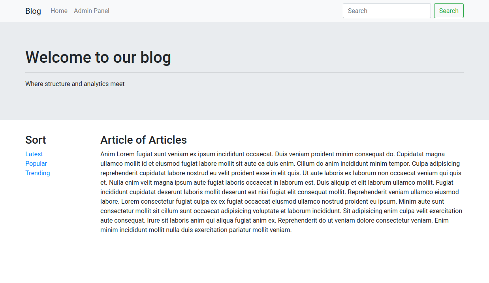

# blog

## Instructions

1. Understand each dir's purpose. 
> - **posts** is for post operations. Want to add or delete a post? This is your dir!
> - **static** holds public items that won't change. *bootstrap* is here for ease of access
> - **config** has all the constants for certain environments. *db.go* holds credentials to access the db. *post.go* holds the key a sysadmin will distribute to writers
> - **templates** holds our main template, *index.html*, and functions to easily insert html.
> - **main.go** is the file for routes and running the server. You can change the port number to any port you would use for a go app!

## Make this Work
1. Navigate to config/db.go. Change the return strings in order of username, password, and database name.
2. Navigate to config/post.go. Change this return string to whatever you would like
3. Run go get .
4. go build main.go
5. ./main

## Routes

>Refer to main.go for all routes. Use cases will be commented right next to them.